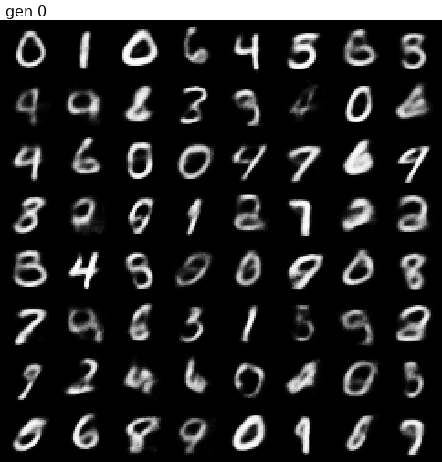
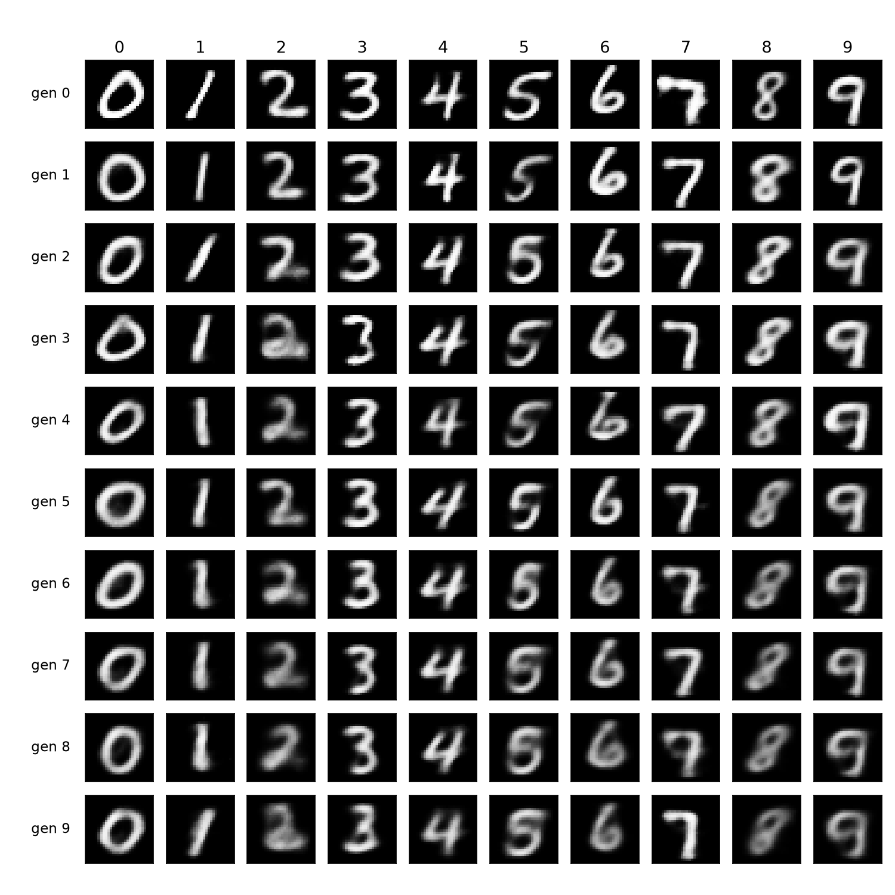
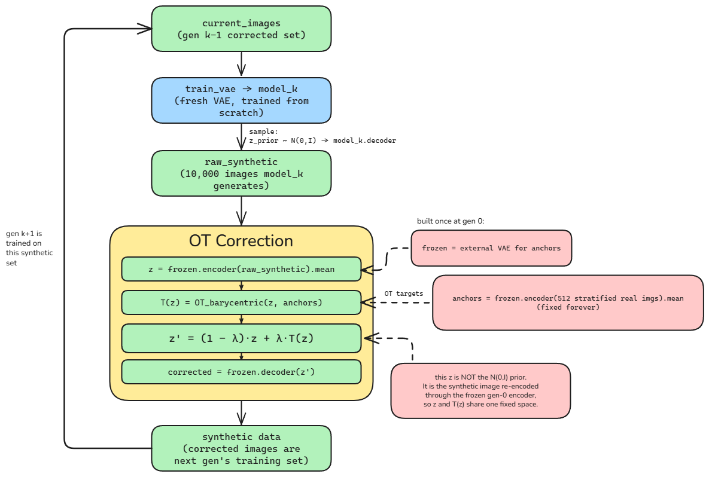
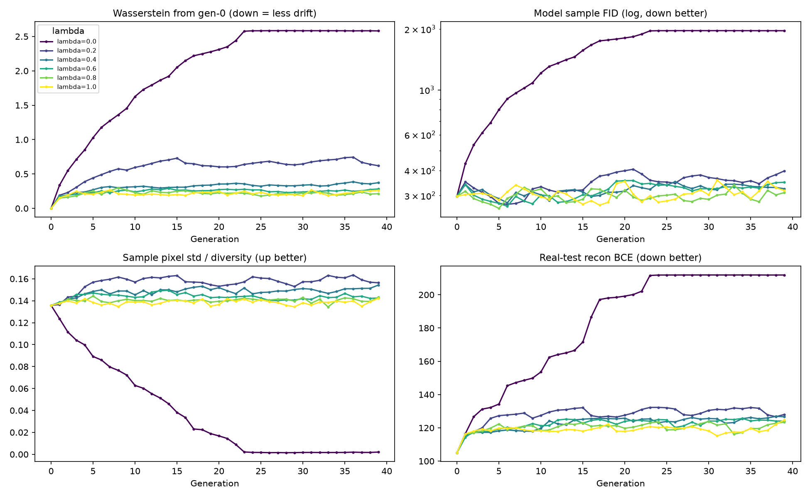
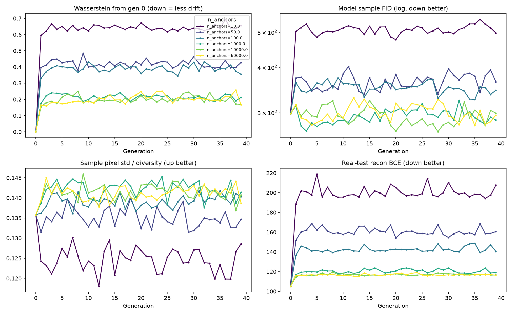
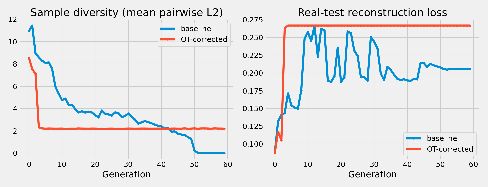
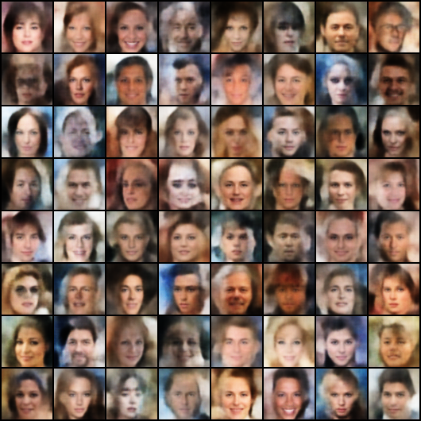
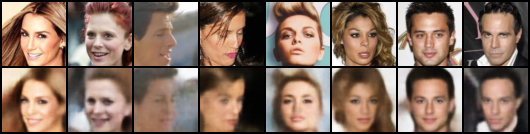

# Model Collapse & Optimal-Transport Correction

Generative models increasingly train on data produced by earlier generative models. When that loop closes on itself, i.e., a model trained on the previous model's output, the distribution drifts, the tails vanish, and samples decay into a few blurry modes. This is **model collapse**.

This repository studies collapse in a **self-consuming Variational Autoencoder (VAE)** loop and implements a **batch optimal-transport (OT) corrector** that arrests it by transporting each generation's latents back onto a fixed reference of real data before the next model trains.

<sub>Python · PyTorch · [POT](https://pythonot.github.io/) (Python Optimal Transport) · NumPy / SciPy · Matplotlib</sub>

---

<table>
<tr>
<td align="center"><b>No correction &nbsp;(λ = 0)</b></td>
<td align="center"><b>Fully OT-corrected &nbsp;(λ = 1.0)</b></td>
</tr>
<tr>
<td></td>
<td></td>
</tr>
</table>

*Each frame is one generation (0 → 49) sampling from its own `N(0, I)` prior. Left: diversity drains away and the model piles onto a handful of prototypes. Right: with OT correction the model keeps generating varied digits for all 50 generations.*

---

## Key findings

- **Uncorrected loops collapse fast.** With no correction (λ = 0) the MNIST VAE loses almost all sample diversity within ~25 generations. Wasserstein-drift and FID blow up, pixel-diversity flatlines near zero.
- **A small correction is enough.** Any λ > 0 arrests the collapse; even λ = 0.2 keeps drift, FID, diversity and reconstruction error near their generation-0 values (see the λ sweep below).
- Minibatch-OT keeps exact Earth Mover's Distance tractable against anchor pools of up to 60,000 samples at a near-constant ~2 s / generation, independent of pool size.

---

## Background: the self-consuming loop

Each generation trains a **fresh** VAE from scratch on the previous generation's synthetic images, then samples a new synthetic set from its prior:

```
gen 0 <- real images
gen 1 <- images decoded from gen 0's prior samples
gen 2 <- images decoded from gen 1's prior samples
...
```

With nothing anchoring it to real data, the model forgets the distribution's tails and the samples grow blurry and homogeneous. Rows below are generations, columns are digit classes:



---

## Method: batch optimal-transport correction

A single **frozen generation-0 VAE** plus a fixed set of class-stratified **real anchor latents** define a drift-free reference space. Before each new generation trains, every synthetic image is re-encoded into that space, transported toward the anchors by optimal transport, and decoded back:

$$z' = (1-\lambda)\,z + \lambda\,T(z)$$

where `z` is the synthetic latent (re-encoded by the frozen encoder), `T(z)` is its OT **barycentric projection** onto the real anchors, and **λ** controls the correction strength (0 = off, 1 = full projection onto the anchor manifold).



**Minibatch-OT.** Exact OT against tens of thousands of anchors is intractable, so for each source chunk the solver draws a fresh random `K`-subset of the anchor pool and transports onto that. Resampled per chunk so the whole pool is covered over the run while every solve stays small. Cost tracks `K`, not the pool size. Both exact EMD and entropic **Sinkhorn** couplings are supported.

---

## Results

### Correction strength (λ) sweep — full anchor space

The uncorrected run (dark purple, λ = 0) collapses on every metric; **any** λ > 0 holds the line. Intermediate λ (≈ 0.6–0.8) best balances low drift against reconstruction fidelity.



### Anchor-pool size sweep — λ = 0.8

More anchors reduce drift and improve fidelity, but the benefit **saturates around ~1,000** anchors, which is evidence that the *coverage constraint*, not raw anchor count, is what prevents collapse.



### Baseline vs. corrected (λ = 1.0)

The baseline's sample diversity decays to zero, and the corrected loop holds a stable floor. Note the trade-off in the right panel: a full λ = 1.0 snap fixes diversity but saturates reconstruction error. This is why some intermediate λ above is preferable.



### Generality: CelebA (64×64)

The same machinery runs on RGB faces via a convolutional VAE.

<table>
<tr><td align="center"><b>Prior samples</b></td><td align="center"><b>Reconstructions</b></td></tr>
<tr>
<td></td>
<td></td>
</tr>
</table>

Run the loop for 50 generations and the same collapse appears — and the same correction stops it:

<table>
<tr>
<td align="center"><b>No correction &nbsp;(λ = 0)</b></td>
<td align="center"><b>OT-corrected &nbsp;(λ = 0.8)</b></td>
</tr>
<tr>
<td></td>
<td></td>
</tr>
</table>

*Both panels show what each generation's model generates from its own prior (for the corrected run, samples taken **before** correction is applied — so this is a like-for-like comparison of the trained models, not of their corrected outputs). Left: faces blur together by generation 20 and flatten into a single featureless prototype by generation 30. Right: varied, recognisable faces through all 50 generations.*

> This is also the clearest illustration of a metric caveat. CelebA drift is measured in a coarse pixel-pooling feature space that discards exactly the high-frequency detail a VAE loses first, so the Wasserstein numbers **understate** the CelebA collapse relative to what the samples show.

---

## Repository structure

| Path | What it is |
|------|------------|
| `vae.py` | MLP encoder/decoder (28×28) and convolutional encoder/decoder (CelebA), shared loss. |
| `vae_self_consuming.py` | The self-consuming loop, metrics, and command-line interface (`--dataset`, `--correction-lambda`, `--n-anchors`, `--anchor-minibatch`, …). |
| `ot_corrector.py` | Anchor building, EMD/Sinkhorn barycentric projection, nearest-neighbour baseline, and minibatch-OT. |
| `feature_extractor.py` | Small CNN classifier used as the fixed feature space for FID. |
| `Figures/` | Plotting & analysis scripts (`vae_plots.py`, `vae_exp_analysis.py`, `vae_collapse_gif.py`, `vae_recon_gif.py`, `metrics.py`, …). |
| `Imgs/` | Rendered figures and animations. |
| `Report/` | LaTeX pipeline figure and rendered diagrams. |
| `runs/` | Per-experiment outputs (`summary.csv`, per-generation grids, comparison plots). |

`data/`, `dataset/`, and `outputs/` (datasets, CelebA JPEGs, checkpoints) are git-ignored.

---

## Getting started

```bash
pip install torch torchvision pot numpy scipy matplotlib pillow tqdm
```

MNIST and Fashion-MNIST download automatically. For CelebA, place the aligned JPEGs at `dataset/img_align_celeba/*.jpg`.

```bash
# 1. Baseline collapse (MNIST, no correction)
python vae_self_consuming.py --generations 50 --epochs 60 \
    --output-root runs/baseline

# 2. OT-corrected (MNIST, exact EMD, 5,000 anchors, λ = 0.8)
python vae_self_consuming.py --generations 50 --epochs 60 \
    --correction-lambda 0.8 --n-anchors 5000 --output-root runs/ot_lambda0.8

# 3. Large anchor pool via minibatch-OT (60,000 anchors)
python vae_self_consuming.py --generations 50 --epochs 60 \
    --correction-lambda 0.8 --n-anchors 60000 --anchor-minibatch 1000 \
    --output-root runs/ot_minibatch

# 4. Fashion-MNIST
python vae_self_consuming.py --dataset fashion_mnist --generations 50 --epochs 60 \
    --correction-lambda 0.8 --n-anchors 5000 --output-root runs/fashion_ot

# 5. CelebA (64x64 convolutional VAE)
python vae_self_consuming.py --dataset celeba --generations 50 --epochs 40 \
    --num-synth 10000 --correction-lambda 0.8 --n-anchors 50000 --anchor-minibatch 1000 \
    --output-root runs/celeba_ot
```

<sub>On Windows PowerShell, replace the trailing `\` line-continuations with a backtick `` ` ``.</sub>

Each run writes `summary.csv` / `summary.json`, a `collapse.png` metric plot, and per-generation sample grids. Regenerate the paper figures with the scripts in `Figures/`.

---

## Metrics

| Column | Meaning | 
|--------|---------|
| `fid` | Fréchet distance in the fixed feature space | 
| `w_from_gen0` | Sliced Wasserstein drift of samples vs. generation 0 | 
| `sample_pixel_std`, `mean_pairwise_l2` | Sample diversity | 
| `post_std_mean` | Spread of the aggregated posterior means | 
| `test_bce` | Reconstruction error on a fixed real test set | 

FID uses a small CNN trained on the dataset itself (MNIST / Fashion-MNIST) or a self-contained pixel-pool feature space (CelebA). Metric magnitudes are therefore only comparable within a dataset, not across.

---

## References

- Shumailov et al. (2024). *AI models collapse when trained on recursively generated data.* Nature.
- Alemohammad et al. (2024). *Self-Consuming Generative Models Go MAD.* ICLR.
- Gillman et al. (2024). *Self-Correcting Self-Consuming Training Loops for Generative Models.* ICML.
- Fatras et al. (2020). *Learning with minibatch Wasserstein.* AISTATS.
- Flamary et al. (2021). *POT: Python Optimal Transport.* JMLR.

---

## Acknowledgements

Research project conducted under the supervision of **Associate Professor Marcus Gallagher** (The University of Queensland).
